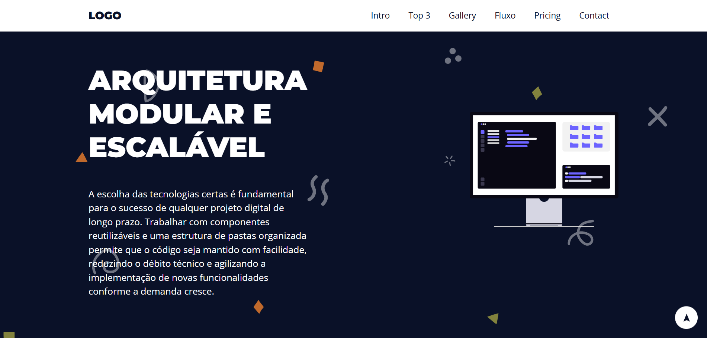

# 🚀 Landing Page - Pilares do Desenvolvimento

Uma Landing Page responsiva e moderna, desenvolvida com foco em **HTML5 Semântico** e **CSS3 Avançado**, abordando boas práticas de desenvolvimento de software.



## 📋 Sobre o Projeto

Este projeto consiste em uma página de aterrissagem (Landing Page) completa, simulando a apresentação de um serviço ou produto de tecnologia. O objetivo principal foi aplicar conceitos de layout responsivo sem o uso de frameworks (como Bootstrap), utilizando apenas CSS puro para garantir leveza e performance.

### 🎯 Funcionalidades e Destaques

* **Design Totalmente Responsivo:** Adaptação fluida para Desktop, Tablet e Mobile (Media Queries).
* **Menu Mobile "Pure CSS":** Menu hambúrguer funcional sem uso de JavaScript (Checkbox Hack).
* **CSS Grid & Flexbox:** Utilização moderna para estruturação de layouts complexos (Galeria e Cards).
* **Tabelas Responsivas:** Seção de "Pricing" adaptada para telas pequenas com rolagem horizontal.
* **Arquitetura de Arquivos:** Separação de responsabilidades em `elements.css` (estilos base) e `style.css` (layout e componentes).
* **Variáveis CSS:** Uso de `:root` para fácil manutenção de cores e espaçamentos.

## 🛠 Tecnologias Utilizadas

* **HTML5:** Estrutura semântica (`<header>`, `<section>`, `<article>`, `<aside>`, `<footer>`).
* **CSS3:** Estilização avançada.
* **Google Fonts:** Tipografias Montserrat e Open Sans.
* **Git:** Controle de versão.

## 📂 Estrutura de Pastas

```bash
/
├── assets/
│   ├── css/
│   │   ├── elements.css  # Reset e estilos globais de tags
│   │   └── style.css     # Estilos de layout, classes e media queries
│   └── img/              # Imagens e SVGs do projeto
└── index.html            # Arquivo principal